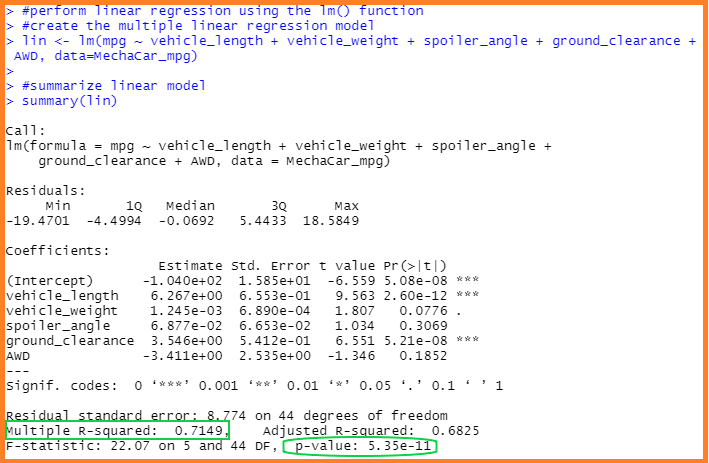
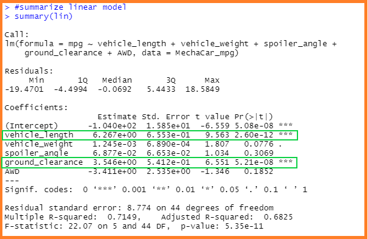
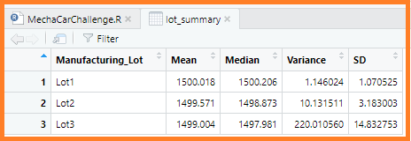
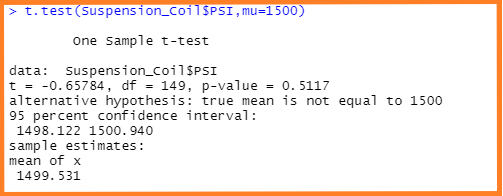
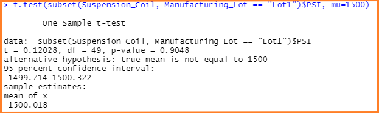
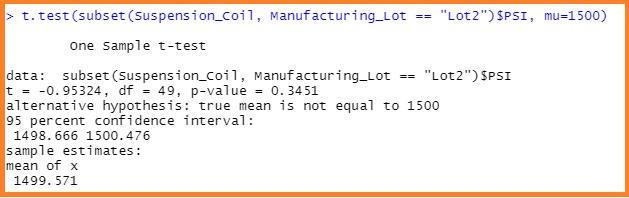
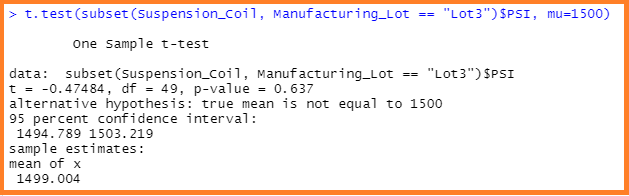

# MechaCar_Statistical_Analysis
New project on AutosRUs’ newest prototype, the MechaCar.

## Project Overview
This project will be using R to address AutosRUs’latest production issues which are blocking the manufacturing team's progress. Ergo, this assignment consists of four (4) technical deliverables. They are:

- Deliverable 1: Linear Regression to Predict MPG
- Deliverable 2: Summary Statistics on Suspension Coils
- Deliverable 3: T-Test on Suspension Coils
- Deliverable 4: Design a Study Comparing the MechaCar to the Competition

## Purpose
The purpose of this project is to review the production data of AutosRUs’ for insights that may help the manufacturing team and remove any blockages. This project will seek to excutute on the following four (4) task outlined below.
- Perform multiple linear regression analysis to identify which variables in the dataset predict the mpg of MechaCar prototypes
- Collect summary statistics on the pounds per square inch (PSI) of the suspension coils from the manufacturing lots
- Run t-tests to determine if the manufacturing lots are statistically different from the mean population
- Design a statistical study to compare vehicle performance of the MechaCar vehicles against vehicles from other manufacturers. For each statistical analysis, write a summary interpretation of the findings.

## Resources
- **Data Source:** MechaCar MPG dataset, Suspension Coil dataset
- **Software:** RStudio, Github, VisualStudio
- **Abbreviation:** PSI = Pound(s) per Square Inch

## MechaCar Statistical Analysis Results
>
### **Linear Regression to Predict MPG**
>
#### Which variables/coefficients provided a non-random amount of variance to the mpg values in the dataset?
> The variables which provided a non-random amount of variance to the mpg values in the dataset are `vehicle_length` and `gound_clearance`.
>
>**Image showing the non-random variance in the mpg values of the dataset:**
>
>
>
#### Is the slope of the linear model considered to be zero? Why or why not?
> The slope of the linear model is considered `not` to be zero; this is simply due to the fact that the coefficients values are not zero.
>
>**Image showing the non-random variance in the mpg values of the dataset:**
>
>
>
#### Does this linear model predict mpg of MechaCar prototypes effectively? Why or why not?
> Based on the results,it can be said that this linear model predict mpg of MechaCar prototypes effectively. The model generated a `Multiple R-squared` value of `0.7149` and a `p-value` of `5.35e-11`. This is a clear indication, that the `null hypothesis` should be `rejected`. It can be said that approximately `72%` of the predictions will be correct based on the results produced by the Multiple R-squared value (`0.7149`), alternatevily if we should also look at the results produced by the Adjusted R-Square (`0.6825`), we are able to conclude that `68%` of the predictions will be correct.
>
### **Summary Statistics on Suspension Coils**
>
#### Summary Statistics Table **(Total Summary)**
>
>**Image showing the `total summary` dataframe that has the `mean`, `median`, `variance`, and `standard deviation` of the PSI for all manufacturing lots:**
>
>
>
#### Summary Statistics Table **(Lot Summary)**
>
>**Image showing the `total summary` dataframe that has the mean, median, variance, and standard deviation for each manufacturing lot:**
>
>
>
#### Design Specification Requirements
>**The design specifications for the MechaCar suspension coils dictate that the variance of the suspension coils must not exceed 100 pounds per square inch. Does the current manufacturing data meet this design specification for all manufacturing lots in total and each lot individually? Why or why not?**
>
>- In summary it can be said that all lots are in total variance is `76.23` psi and all lots in total meet the design specifications. This mostly is due to the fact that the variance of the suspension coils does not exceed 100 pounds per square inch.
>- Lots 1 and 2 meets the design specification variance that does not exceed 100 psi. Their variance `1.15` and `10.13` psi respectively.
>- Since Lot 3 resulted in a variance of `220 psi`, individually, it would fail to meet the design specification requirement as it exceeded by 120 psi.
>
### T-Tests on Suspension Coils
>
> **T-Test on `All` lots**
>The results produce a p-value of `0.05`; this therfore means that there is not sufficent evidence to reject the null hypothesis
>
>**Image showing the results of the T-Test on all Lots:**
>
>
>
> **T-Test on Lot - 1**
>The results produce a p-value of `0.05`; this therfore means that there is not sufficent evidence to reject the null hypothesis
>
>**Image showing the results of the T-Test on Lot 1:**
>
>
>
> **T-Test on Lot - 2**
>The results produce a p-value of `0.05`; this therfore means that there is not sufficent evidence to reject the null hypothesis
>
>**Image showing the results of the T-Test on Lot 2:**
>
>
>
> **T-Test on Lot - 3**
>The results produce a p-value of `0.05`; this therfore means that there is not sufficent evidence to reject the null hypothesis
>
>**Image showing the results of the T-Test on Lot 3:**
>
>

## Study Design: MechaCar vs Competition
> When a consumer decides to buy a car, there could be many factors in place based on prefence, Some of the most common ones are `cost/price`, `safety features/rating`, `type of engine` and `fuel economy` to name a few. One of the key metrics that could be tested is the `safety features` on MechaCar to its competitors to see how camparable they are. The null or alternative hypothesis could state:
> **Null Hypothesis (Ho):** There is no statistical difference between the `Saftey Features` of MechaCar and the Competition
> **Alternate Hypothesis (Ha):** There is a statistical difference between the `Saftey Features` of MechaCar and the Competition
> The T-Test would be the prefered choice to test the hypothesis as it would allow for us to compare the two companies and determine whether there are any significant differences/statistical evidence between the two in favour of the hypothesis. To run the statistical test data that details the vehicle make and/or model `crashworthiness`- how well a vehicle protects its occupants in a crash - and  `crash avoidance and mitigation` - technology that can prevent a crash or lessen its severity.